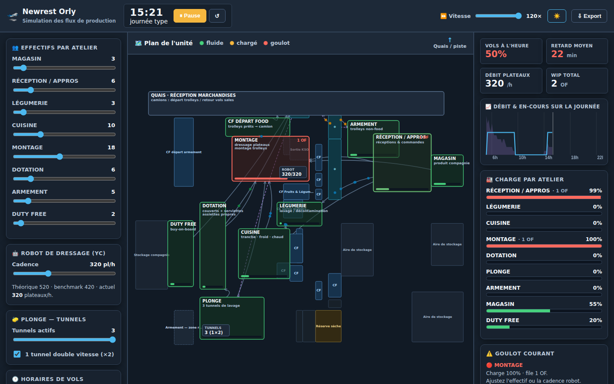
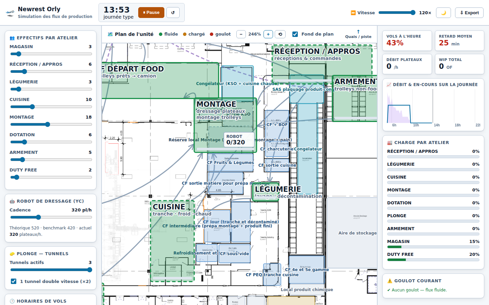

# 🛫 Newrest Orly — Simulation des flux de production

Simulation visuelle et dynamique des flux d'une **unité de catering aérien**.
L'objectif : **repérer visuellement les goulots (bouchons)**, **mesurer la charge
par atelier** et **tester des scénarios what-if** (effectifs, cadence robot,
tunnels de plonge, horaires de vols) sur une journée type.

Application **navigateur, hors-ligne, sans dépendance externe**. Un jeu de données
d'exemple réaliste (vague matin + vague soir) est embarqué : tout est fonctionnel
dès l'ouverture.


## ▶️ Lancer

Ouvrez `index.html` dans un navigateur, ou servez le dossier
(`python3 -m http.server`). Cliquez sur **▶ Lancer** ; ajustez la vitesse.

> ℹ️ Le projet est actuellement en deux fichiers (`index.html` + `sim.js`) pour
> faciliter l'itération. Les deux s'ouvrent hors-ligne par double-clic. Un
> **bundle en un seul fichier HTML autonome** peut être généré sur demande.

## 🎨 Lisibilité

Thème **clair à fort contraste** par défaut (lecture de plan, vidéoprojection,
impression). Un **thème sombre** est disponible via le bouton 🌙 de l'en-tête ;
le choix est mémorisé.



## 🗺️ Le plan (cœur du livrable)

Le fond est **le plan d'architecte réel de l'unité** (`docs/MAP_ORY.xlsx`),
découpé en 12 tuiles et réassemblé (`assets/plan/`). Les zones interactives sont
posées par-dessus, en translucide, pour laisser voir les locaux.

L'alignement est **exact par construction** : les tuiles et les zones sont
placées à partir des mêmes ancrages du fichier source (colonne = 82 px,
ligne = 14,4 pt = 19,2 px).

**Zoom & déplacement** : molette ou boutons `−` / `+` / `⟲`, glisser pour se
déplacer. Au-delà de ~170 % les libellés des chambres froides apparaissent et
le plan CAD (noms de pièces, cotes, surfaces) devient lisible. La case
**Fond de plan** masque le CAD pour ne garder que le schéma des flux.



### Zones

Reprises telles quelles des annotations du plan : **CF départ food, Armement,
Montage, Magasin, Dotation, Légumerie, Duty free**, plus toutes les
**chambres froides, congélateurs, aires de stockage et locaux**
(CF + BOF, CF charcuterie, CF Jour, CF intermédiaire, CF PEQ tranche cuisine,
congélateur, réserve sèche, local QHSE…) — survol = nom complet.

> ⚠️ Les zones marquées **`?`** ne sont pas annotées sur le plan source : elles
> sont **placées approximativement** (pointillés) et doivent être corrigées.

## ✏️ Corriger les zones (mode édition)

Les tailles et emplacements des zones ne sont pas déductibles du plan source :
c'est à l'exploitant de les poser. L'outil est fait pour ça.

1. Bouton **✏️ Éditer les zones** dans l'en-tête du plan.
2. Cliquez une zone (sur le plan ou dans la liste du panneau de gauche).
3. **Glissez** le rectangle pour le déplacer, tirez un **coin** pour le
   redimensionner — ou saisissez **X / Y / Largeur / Hauteur** au clavier.
   **⬚ Redessiner** permet de retracer entièrement la zone à la souris.
4. Zoomez (molette) pour viser précisément les locaux du plan.
5. Une zone corrigée perd son marquage « à confirmer ».

Les modifications sont **sauvegardées automatiquement** dans le navigateur.

**📋 Copier le JSON** / **⇩ Exporter** produit un fichier de ce type, à
transmettre pour l'intégrer comme valeurs par défaut dans `sim.js` :

```json
{
  "plonge": { "nom": "PLONGE", "x": 1501, "y": 1876, "w": 500, "h": 330, "approx": false }
}
```

**📂 Importer** relit un tel fichier ; **↺ Tout réinitialiser** revient aux
valeurs d'origine.

- **Tokens animés** circulant le long des arêtes du graphe de flux.
- **Code couleur de congestion** par atelier : 🟢 fluide → 🟠 chargé → 🔴 goulot.
- **Ressources dédiées** affichées en direct : le **robot de dressage** (YC) et
  les **3 tunnels de plonge** (1 double vitesse + 2 simples).
- Cliquez sur un atelier pour voir son détail (charge, file, effectif).

## 📊 Tableau de bord (en direct)

- **% de vols à l'heure** et **retard moyen**.
- **Débit plateaux/h** (robot) et **WIP** (en-cours) total.
- **Charge (utilisation) par atelier** avec longueur de file.
- **Courbe** débit & en-cours sur la journée (pics matin/soir visibles).
- **Goulot courant** mis en évidence.

## 🎛️ Leviers what-if (effet immédiat)

- **Effectif par atelier** (sliders).
- **Cadence du robot** de dressage : 320 (actuel) → 420 (benchmark) → 520 (théorique).
- **Nombre de tunnels de plonge** actifs + tunnel double vitesse.
- **Décalage horaire** global des vols et **délai de chargement**.
- **Comparaison de scénarios A vs B** sur les KPI clés.
- **Import `vols.csv`** (schéma tolérant) et **export JSON** des résultats.

Exemple mesuré sur la journée d'exemple :

| Scénario                     | Vols à l'heure | Retard moyen |
|------------------------------|:--------------:|:------------:|
| Robot 320 · Prépa 18         | 67 %           | 15 min       |
| Robot 520 · Prépa 24         | 100 %          | 0 min        |

## 🧠 Modèle de simulation

Moteur de flux à stations, alimenté par les **man-minutes** et les **données de
vols** :

- Chaque vol génère des **OF** (ordres de fabrication) par classe (BC/PC/YC) et
  par atelier.
- Chaque atelier est une **station** de capacité = `effectif × disponibilité`
  (consommation de man-minutes) ; une **file** se forme quand la demande dépasse
  la capacité sur la fenêtre de temps → **goulot**.
- Les **précédences** du graphe de flux sont respectées (Appros → Cuisine →
  Prépa → Frigo handling → Piste, etc.).
- Le **robot** est une ressource dédiée aux plateaux YC ; la **plonge** traite
  les retours sales selon les tunnels actifs.
- Un vol est **à l'heure** si ses trolleys atteignent le frigo handling avant
  `heure_std − délai_chargement`.

## 🗂️ Structure

| Fichier            | Rôle                                                          |
|--------------------|---------------------------------------------------------------|
| `index.html`       | Structure, thème et disposition (plan + dashboard + leviers)  |
| `sim.js`           | Données d'exemple, moteur, rendu SVG, zoom, contrôles         |
| `assets/plan/`     | Les 12 tuiles du plan d'architecte réel                       |
| `docs/MAP_ORY.xlsx`| Carte source fournie par Newrest (référence)                  |

Paramètres regroupés en tête de `sim.js` (bloc `CFG`) : cadence robot, tunnels,
délai de chargement, effectifs, fenêtre de la journée.

## 🚧 Suite prévue

Interface d'abord (objet de cette étape). Pistes d'affinage du moteur :
événements discrets plus fins, `man_minutes.csv` / `staffing.csv` importables,
clé de répartition paramétrable par atelier, capture du plan en image.
