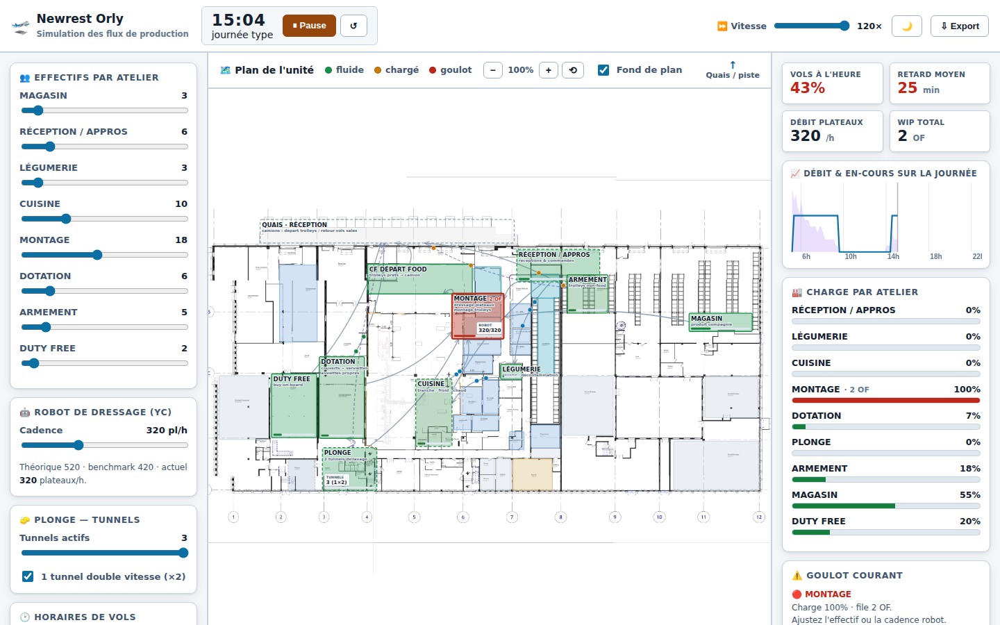

# 🛫 Newrest Orly — Simulation des flux de production

Simulation visuelle et dynamique des flux d'une **unité de catering aérien**.
L'objectif : **repérer visuellement les goulots (bouchons)**, **mesurer la charge
par atelier** et **tester des scénarios what-if** (effectifs, cadence robot,
tunnels de plonge, horaires de vols) sur une journée type.

Application **navigateur, hors-ligne, sans dépendance externe**. Un jeu de données
d'exemple réaliste (vague matin + vague soir) est embarqué : tout est fonctionnel
dès l'ouverture.

## ▶️ Lancer

Ouvrez `index.html` dans un navigateur, ou servez le dossier
(`python3 -m http.server`). Cliquez sur **▶ Lancer** ; ajustez la vitesse.

> ℹ️ Le projet est actuellement en deux fichiers (`index.html` + `sim.js`) pour
> faciliter l'itération. Les deux s'ouvrent hors-ligne par double-clic. Un
> **bundle en un seul fichier HTML autonome** peut être généré sur demande.

## 🗺️ Le plan (cœur du livrable)

Le plan est **reconstruit fidèlement à partir de la carte réelle de l'unité**
(`MAP_ORY.xlsx`) : positions, libellés et chambres froides sont ceux du plan
Orly. En haut les **quais / réception marchandises** (camions), en bas
l'intérieur de l'unité.

Ateliers (stations de simulation) : **Réception/Appros, Magasin, Cuisine,
Légumerie, Montage (dressage + robot), Dotation, Duty free, Armement, Plonge**,
plus le **CF départ food**. Sont aussi dessinées **toutes les chambres froides,
congélateurs, aires de stockage et locaux** (CF + BOF, CF charcuterie, CF Jour,
CF PEQ tranche cuisine, congélateur, réserve sèche, local QHSE, etc.) —
survolez-les pour le nom complet.

- **Tokens animés** circulant le long des arêtes du graphe de flux.
- **Code couleur de congestion** par atelier : 🟢 fluide → 🟠 chargé → 🔴 goulot.
- **Ressources dédiées** affichées en direct : le **robot de dressage** (YC) et
  les **3 tunnels de plonge** (1 double vitesse + 2 simples).
- Cliquez sur un atelier pour voir son détail (charge, file, effectif).

## 📊 Tableau de bord (en direct)

- **% de vols à l'heure** et **retard moyen**.
- **Débit plateaux/h** (robot) et **WIP** (en-cours) total.
- **Charge (utilisation) par atelier** avec longueur de file.
- **Courbe** débit & en-cours sur la journée (pics matin/soir visibles).
- **Goulot courant** mis en évidence.

## 🎛️ Leviers what-if (effet immédiat)

- **Effectif par atelier** (sliders).
- **Cadence du robot** de dressage : 320 (actuel) → 420 (benchmark) → 520 (théorique).
- **Nombre de tunnels de plonge** actifs + tunnel double vitesse.
- **Décalage horaire** global des vols et **délai de chargement**.
- **Comparaison de scénarios A vs B** sur les KPI clés.
- **Import `vols.csv`** (schéma tolérant) et **export JSON** des résultats.

Exemple mesuré sur la journée d'exemple :

| Scénario                     | Vols à l'heure | Retard moyen |
|------------------------------|:--------------:|:------------:|
| Robot 320 · Prépa 18         | 67 %           | 15 min       |
| Robot 520 · Prépa 24         | 100 %          | 0 min        |

## 🧠 Modèle de simulation

Moteur de flux à stations, alimenté par les **man-minutes** et les **données de
vols** :

- Chaque vol génère des **OF** (ordres de fabrication) par classe (BC/PC/YC) et
  par atelier.
- Chaque atelier est une **station** de capacité = `effectif × disponibilité`
  (consommation de man-minutes) ; une **file** se forme quand la demande dépasse
  la capacité sur la fenêtre de temps → **goulot**.
- Les **précédences** du graphe de flux sont respectées (Appros → Cuisine →
  Prépa → Frigo handling → Piste, etc.).
- Le **robot** est une ressource dédiée aux plateaux YC ; la **plonge** traite
  les retours sales selon les tunnels actifs.
- Un vol est **à l'heure** si ses trolleys atteignent le frigo handling avant
  `heure_std − délai_chargement`.

## 🗂️ Structure

| Fichier          | Rôle                                                         |
|------------------|--------------------------------------------------------------|
| `index.html`     | Structure, thème et disposition (plan + dashboard + leviers) |
| `sim.js`         | Données d'exemple, moteur de simulation, rendu SVG, contrôles |

Paramètres regroupés en tête de `sim.js` (bloc `CFG`) : cadence robot, tunnels,
délai de chargement, effectifs, fenêtre de la journée.

## 🚧 Suite prévue

Interface d'abord (objet de cette étape). Pistes d'affinage du moteur :
événements discrets plus fins, `man_minutes.csv` / `staffing.csv` importables,
clé de répartition paramétrable par atelier, capture du plan en image.
